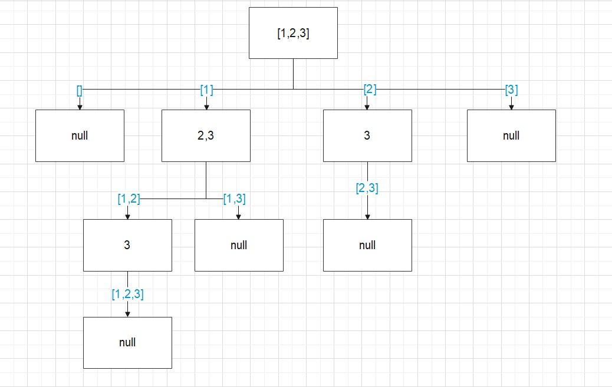

回溯算法又名探索與回溯法,核心是按條件向前搜索,當選擇不達標,就退回一步重新選擇。**当问题需要 "回头"，以此来查找出所有的解的时候**，就可以用回溯算法。


## 回溯算法步驟

1. 畫出遞歸樹,找到狀態變量
2. 根據題意,確定結束條件
3. 找準選擇列表
4. 判斷是否需要剪枝
5. 作出選擇,遞歸調用,進入下一層
6. 撤銷選擇

### 題目

配合leetcode78題子集解釋回溯法。

> 給你一個整數數組 `nums` ，數組中的元素 **互不相同** 。返回该數組所有可能的子集（幂集）。

```markdown
输入：nums = [1,2,3]
输出：[[],[1],[2],[1,2],[3],[1,3],[2,3],[1,2,3]]

输入：nums = [0]
输出：[[],[0]]
```


### 1.畫出遞歸樹,找到狀態變量

首先我們可以畫出遞歸樹,下圖中藍色的小字是我們選擇結果,而方框裡的是我們可以選擇的選項。當我們選[2]時,剩下可供的選擇只有3;當我們選[3]時,就沒有可供的選擇了...。

因此,我們可以用一個參數記錄當前的選擇,**用來標識當前的選擇列表的起始位置,決定我們之後可以選擇什麼。**這個參數就是狀態變量。我們用start表示



### 2.確定結束條件

在此題中,當start参数越過数组邊界或為空時,程序就自己跳過下一层递歸了，因此不需要手寫结束條件。因此不存在結束條件。

### 3.找準選擇列表

選擇列表即遞歸樹中的方框,我們在上面已經畫出來了

```javascript
for(let i = start;i < nums;i++) // start控制了可選項
    							//start = 2時,只能3一個元素可以遍歷
```

### 4.判斷是否需要剪枝

如果路徑沒重複,就不需要剪枝。本題數組中的元素 **互不相同**,因此不需要剪枝。

若果數組中的元素是[1,2,2],需要排序後判斷nums[i]  === nums[i - i] ,如果滿足就跳過。

### 5.做出选择

我們做出选择,并用path記錄選擇結果(藍字),每次循環都調用自己(下面會展開說),調用自己需要傳入nums ,path,i+1(start)。

```javascript
for(leti = start;i < nums.length;i++){
    path.push(nums[i]) //选择
    backtrack(nums,path,i+1) // 回溯函數 
    						//参數: 1.nums數組 2.選擇結果 3.start參數
 }
```

### 6.撤銷選擇

不管成功与否，退回上一步。以遞歸樹的[1]為例。當選擇了[1],可以選2或3,即[1,2]與[1,3],但選了2之後需要退回上一步才能到達[1,3]。就好像一條分岔路,走了其中 一條路之後,你要先回到分岔點才能走另一邊。

```javascript
path.pop()
```

## 完整代碼


```javascript
var subsets = function(nums) {
    if(!Object(nums).length){
        return []
    }
    let len = nums.length;
    let result = [];

    const backtrack = (path,start)=>{
        result.push(path.slice());
        for (var i = start; i < len; i++) {
        path.push(nums[i]) //試探
        backtrack(temp, i+1); 
        path.pop(); //不管成功與否，退回上一步
    }
    }

    backtrack([], 0);
    return result
};
```

