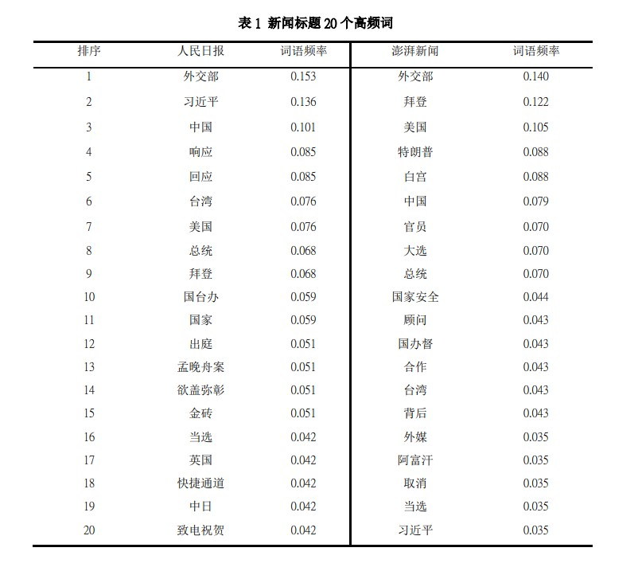
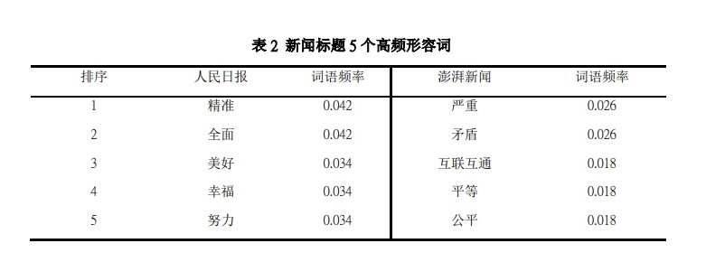

## 前言

上學期未被要求寫一篇新聞內容分析的論文,一提到分詞與特徵提取,在腦海中沉現的盡是各種python庫。python雖好,但我已經有很長一段時間沒寫py,甚至連環境都卸載了。為了降低學習成本與盡快交犒(~~就是懶~~),我試著在npm上找相關的庫,結果發現node的分詞庫也是相當強大,足以滿足我的需求。

## segment 分词庫

[segment](https://github.com/leizongmin/node-segment) 是以盘古分词组件中的词库为基础开发的，基于最大匹配的词典分词算法，支持中文分詞。最大匹配分词算法是以词典为依据，取词典中最长词长度作为第一次取字数量的长度，在词典中进行扫描。因此需要按需加入对应的词汇及人物名称才能较准确地分词。詳情可以看[這裡](https://zhuanlan.zhihu.com/p/103392455)

segment 分词庫具有以下特点：

- 纯JavaScript编写，可以在任何支持ECMAScript5的引擎上执行（需要稍微修改部分代码）
- 基于词性进行联想识别
- 可使用JavaScript编写自定义的分词模块

## 數據處理

數據已經收集好,并以人工編碼方式整理成表。為了方便後續的處理,我把excel檔案用xlsx庫轉換成json格式,如下

```javascript
[
{
    "index": "1",
    "title": "监狱“手机风云”：罪犯遥控贩毒猎艳，狱警还帮忙充值",
    "media": "12", //媒體
    "platform": "1", //文章發怖平台
    "time": "11.18", 
    "theme": "11", //主題類型
    "genre": "3", //體材類型
    "words": "4311"
  },
  {
    "index": "2",
    "title": "职业差评师出现在外卖平台，“换执照都搞你”",
    "media": "12",
    "platform": "1",
    "time": "11.18",
    "theme": "11",
    "genre": "3",
    "words": "4446"
  }
]
```

## 分析

### 首先安裝與引入

```shell
npm install novel-segment
```

```javascript
let Segment = require('segment');
const fs = require('fs');
```

### 建立分詞器

- 用readFileSync異步讀取我們的json文件
- 以JSON.parse把json由字串轉換成對象
- 遍歷并調用分詞方法
- 以追加方式異步寫入新的json文件

```javascript
function splitWords(){
    let segment = new Segment();
    segment.useDefault();
    segment
    .use('DictTokenizer')// 词典识别
    .use('ChsNameTokenizer')
    .loadDict('names.txt')// 人物名稱识别
    .loadDict('dict4.txt')//自定義词典
    
    let rawdata = fs.readFileSync('data2.json'); 
    let news = JSON.parse(rawdata); 
    for(let i = 0;i < news.length;i++){
        if(news[i].media == 1 || media == 12){ // 1代表人民日報,4代表澎湃新聞
            let text = news[i].title
            let res = segment.doSegment(text, {
                simple: true,
                stripPunctuation: true //去除标点符号
            });
            news[i].splitWords = res
            let new_json = JSON.stringify(news[i])
            fs.writeFileSync('splitWordsResult.json', new_json+',',{flag:'a'});
            console.log(res);
        }
    }
}
```

因為最大匹配分词算法需要按需加入对应的词汇及人物名称才能较准确地分词,所以我在原有基礎上加入41個單詞。

### 統計

```javascript
//統計詞頻
function countWords(){
    let raw = fs.readFileSync('splitWordsResult.json');
    let data = JSON.parse(raw);
    let object = {}
    let count = 0 //記錄總新聞編數
    for(let i = 0;i < data.length;i++){
        count++
        if(item.theme === 1){ // 1代表政治類新聞
        let key = data[i].splitWords
        // 以key:value形式存放單詞詞頻
        for(item of key){
            //去掉長度<=1的單詞
            if(item.length > 1 && !object[item] ){
                object[item] = 1
            }else if(object[item]){
                object[item]++
            }
        }
        }
    }
    fs.writeFileSync('countResult.json', JSON.stringify(object),{flag:'w'});
    //輸出格式
	// "type": "人民日報",
	// "newscount": 118,
	// "words": {
	//          "外交部": 18,
	//          "习近平": 16,
	//          "中国": 12,}
}

//排序并展示
function sort(){
    let showTop = 10 //展示數量
    let raw = fs.readFileSync('result.json');
    let data = JSON.parse(raw);
    let objectKey =Object.entries(data[0].words);
    objectKey = objectKey.sort((a,b)=>b[1] - a[1]);
    for(let i = 0;i < showTop;i++){
        console.log(objectKey[i]);

    }

}
```


词频公式為: F = R / A

F 代表词语频度，R 代表词语出现次数，A 代表样本中政治类新闻总数。把結果代入就可以得出政治类新聞的詞頻結果了。

### 結論



截一小段自己的論文內容

> 表 1 显示的是各样本分类的内容分析结果。从分析结果可以看出两家媒体在政治新闻选 题上有较为不同的倾向，人民日报倾向报导国内时政及解读国家政策，而澎湃新闻则倾向报 导国外政治局势。人民日报的高频特征词中，名词主要表现在中国国家领导人与国家机关(习 近平﹑外交部) ，动词则主要表现在一些官方发言用语(回应﹑响应) ; 而澎湃新闻的高频特 征词中，名词主要表现在国外政治局势及美国大选(拜登﹑特朗普﹑大选)，动词则主要表现 在外交战略关系用语(合作﹑取消)。 
>
> 在两个媒体的高频特征词中，“外交部”都是频度最高的词语，可以推断各国外交部发 言内容是该两媒体的主要新闻选题对象。此外，该两媒体的高频词表中同样包含了“中国” ﹑“习近平” ﹑“美国” ﹑“拜登”，这四个词语在人民日报的出现频率为 0.101﹑ 0.136 ﹑ 0.076﹑0.068，而澎湃新闻则为 0.079﹑0.035﹑0.105﹑0.122。在经相互比对可发现，人民日报 中“中国”与“习近平”被频繁提及，其中“习近平”被提及的频率是澎湃新闻 4 倍之多 ;  在澎湃新闻中则是“美国”与“拜登” 被频繁提及，其中“拜登”被提及的频率是人民日 报 2 倍之多。由此可再次看出两家媒体在政治新闻选题上的倾向。
>
> 另外，高频特征词表中包含许多地区名称，“中国”与“美国”位列人民日报及澎湃新 闻的高频词语第三位，可以推断人民日报的高频政治新闻选题是与中国相关，而澎湃新闻是 美国相关。再看其他地区名称，人民日报除“中国”以外的高频地区名称是“台独”(台湾) ﹑ “ 英国”与“中日”(中国与日本) ，而澎湃新闻是“台湾”与“阿富汗”。经对比原始 数据发现,两媒体在台湾议题上的报导并不一致，人民日报集中报导台独问题，7 条台湾相关5 新闻有 6 条是关于台独的报导 ;而澎湃新闻则分散在台湾间谍﹑F-16 战机起飞后失联等多个 议题。在其他地区的相关报导也出现同样情况，人民日报倾向以多角度集中报导一个议题， 反复强调某一议题 ; 澎湃新闻则倾向较为分散的报导策略。可见在新闻报导与安排上，两 家媒体也有不同的策略倾向...

segment 分词庫支持詞性判斷,所以我們可以按詞性輸出,下面就是只輸出高頻的形容詞



再截一小段自己的論文內容

> 。表 2 显示的是各样本高频形容词的内容分析结 果。人民日报在形容词使用频率略高一点，但两家媒体总体上都没有带入太多的情感词汇， 在形容词的使用频率都在一个非常低的水平。从两家媒体的形容词使用习惯来看，人民日报 偏向使用正面的形容词，5 个高频词都为褒义，多用于表扬某事某人 ; 澎湃新闻使用习惯则 较为多样，高频词中有 2 个贬义﹑2 个褒义 ﹑1 个中性，多用于对某事件的表述。


## 總結
用segment庫處理分詞工作相當絲滑,上手相對簡單,但不加入自定義單詞分詞效果很差,前期需要化大量時間去填充詞彙。另外,詞彙之間會有沖突,所以需要考慮分詞的優先度。