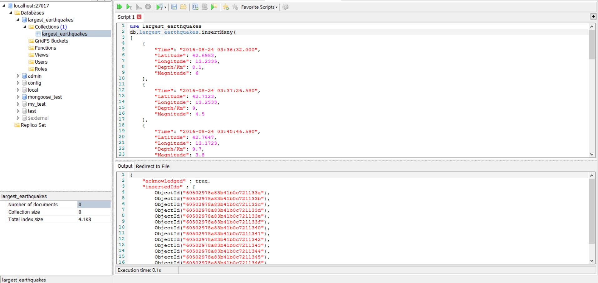

## 從文本加載

讀取主要是用node.js中的fs.readFile

fs.readFile是異步加載文件的方法，比起同步，異步方法效能更高，而且沒有阻塞。在成功讀取後會回傳資料，期間主程是可以執行其他任務的，程序不會因讀文件而被掛起

```javascript
const fs = require('fs') //加載fs

fs.readFile('文件路徑','utf-8',
	(err,result) =>{
		if(err){
		console.log.error('An error occured!')
		return
		}
		console.log(result)
	})

```

也通過Promise封裝一個可複用文本數據讀取器，還read方法回傳一個promise給我們

```javascript
const fs = require('fs')

function read (fileName){
	return new Promise((resolve,reject)=>{
        fs.readFile(fileName,'utf-8',(err,result)=>{
           	if(err){
                reject(err)
                return
            }
            resolve(result)
        })
    })
}
module.exports = {
    read:read
}

//引用
const file = require('module路徑')
file.read('文件路徑')
	.then(data =>{console.log(data)})
	.catch(err => {console.error('An error occurred')})
```

## 從REST API加載

request-promise庫把Node.js的HTTP功能封裝在一個Promise中，我們可以簡易地異步獲取API的內容，它同樣是返回一個promise

```javascript
const request = require('request-promise')
const url = ''
request.get(url)//向目標執行HTTP GET請求
	.then(result => {console.log(result)})
	.catch(error => {console.error('An error occurred')})
```

## 從MongoDB導入數據

MongoDB是一種非SQL數據庫,沒有固定模式。因此,不需要預先定義數據庫的結構。

npm上有多種庫可以從MongoDB數據庫檢索數據,這裡使用的是promised-mogo 庫。

```sh
npm install --save promised-mogo 
```

在訪問之前,我們首先要創建一個largest_earthquakes數據庫及一個largest_earthquakes集合,并在下集合裡面寫入數據,最後映射到localhost指定端口,供我們在node.js中訪問



```javascript
const mongo = require('promised-mongo');

function importFromMongoDB (db, collectionName) {
    return db[collectionName].find().toArray(); //從指定集合檢索
};

//從本地27017端口的largest_earthquakes數據庫中尋找largest_earthquakes集合
//27017為默認端口
//這邊端口必須要跟MongoDB數據庫中保持一致
const db = mongo("localhost:27017/largest_earthquakes", ["largest_earthquakes"]);

importFromMongoDB(db, "largest_earthquakes")//從largest_earthquakes集合中導入數據
    .then(data => {
        console.log(data);
    })
    .then(() => db.close())
    .catch(err => {
        console.error(err);
    });
```