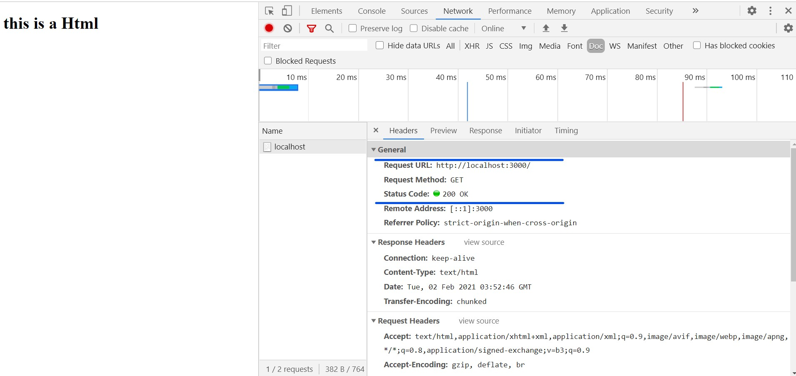
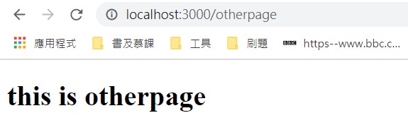

## 引入庫

```javascript
const http = require('http') 
const fs = require('fs') //node的文件管理庫
const port = 3000 //Server端口
```

## 創建Server并監聽

```javascript
const server = http.createServer(function(req,res){
    //req物件可以接收從http server 發過來的請求，例如url、http header 及data
    //res物件則送出回應給 Http 送來的請求
}
                                 server.listen(port,function(error){//持續監聽port端口
    if(error){
        console.log('something wrong',error);
    }else{
        console.log('Server is listening on port' + port);
    }
})
```

在終端執行node <文件名.js>即可創建Server,留意文件路徑。http.createServer與server.listen都帶有一個Callback Function,會在結果回傳時觸發。listen決定要監聽哪一個port，並且開始監聽任何進來的requests，port是可以自行定義,盡量避免用"80″(http的預設port)，"21″(FTP的預設port)

## 寫入response header與返回資源

```javascript
const server = http.createServer(function(req,res){
    res.writeHead(200,{'Content-Type':'text/html'})
    fs.readFile('index.html',function(error,data){
        if(error){//如果readFile出現錯誤
            res.writeHead(404)
            res.write('Error : File Not Found')
        }else{
            res.write(data)
        }
        res.end()
    })
})
```

發送response，首先要先設定response header，用 writeHead() 方法寫入狀態碼與資料類型,然後用fs返回一個在同一層文件路徑的index.html。

當Server架起時,只要不中斷它就會一直運行,編寫的代碼不會熱更新,需要手動重啟Server更新。~~所以有時重啟的確可以解決問題XD~~。輸入localhost:3000就可以看到...



從RequestURL可以看到請求的URL,事實上我們可以對請求進行分析,根據URL返回不同的資訊。

## 處理 Http Request

```javascript
const server = http.createServer(function(req,res){
    res.writeHead(200,{'Content-Type':'text/html'})
    url = req.url === '/otherpage' ? 'otherpage.html' : 'index.html';
    fs.readFile(url,function(error,data){
        if(error){
            res.writeHead(404)
            res.write('Error : File Not Found')
        }else{
            res.write(data)
        }
        res.end()
    })
})
```

可以用req.url來獲取RequestURL,若果請求為localhost:3000/otherpage則返回otherpage.html,否則返回'index.html'。這樣就可以根據請求返回不同資源啦!!



