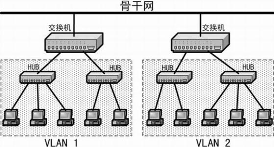

  
## 前言
在这个學習筆记是我對物理層﹑數據鏈路層及網絡層的個人理解，筆記里面可能有錯誤或疏漏的地方。
## 物理層
以二进制数据形式在物理媒体上传输数据,可以理解成兩台計算機相連后用高低電頻進行溝通。但當計算機數量增加時,兩兩相連就會十分擁腫  
設備 : 集線器  
好處 : 价格便宜﹑簡單  
局限 : 當兩以上的節點同時向Hub集線器發信息時,信息可能會互相影響,可以先監聽頻道是否有人佔用,沒有再發信息,防止衝突,但是這樣鏈路上只有一個設備可以發送數據,鏈路利用率低。  
### 通俗來說
在Hub集線器上發信息時,每個用户都是用喊的(廣播)  
如果这個時候正好有别人也在大喊大叫，你就必須等他喊完了再喊(監聽)  
如果你喊的时候不巧碰上另一个人跟你同時喊，那麼你和他喊的内容都不能被聽見(衝突)

## 數據鏈路層
每台設備都具有Mac地址,地址通常是不能改的。交換機后台會維護一張表格,在需要發送信息給指定用户時會查表,獲取對應地址并發送。最初的表是空的,當A端口向B端口發信息時,映射表會先存A的地址,然後再依次查找B,找到再更新B的位置,換言之是通過不斷更新維護表。    
小時候跟基友去網吧用局域網連線打魔獸,就是把多台電腦用LAN線接在一個交換機,讓電腦不用接上亙聯網都可以連線對戰。    
設備 : 交換機  
好處 : 在局域網內部可以組成非常高效的網絡,可支持多個用户同時發信息。  
局限 : 交換機表只有幾千個存儲量,如果用橋接方式擴充連接就必須不斷廣播信息,以找到另一台交換機上的地址,形成消息洪泛。適合小型局域網使用  
### 通俗來說
交換機維護的表格就像一本電話簿,每個用户都有自己手機號碼(Mac地址)  
拨通用手機號碼(建立連接)  
電話簿空間有限,可以在電話簿上寫上另一本電話簿的地址擴充聯係人(橋接)  
當規模龐大時,就可能要轉接大量電話簿(消息洪泛)
## 網絡層
路由器充當交換機的中間人,通過建立路由表維繫交換機之間的關係。路由器利用不同網絡的ID號（即IP地址）來确定數據轉發的地址,IP地址通常由系統分配,不是固定的。IP地址不能直接用於通信,最終通訊都是通過MAC地址的,在跨網絡時需要把IP地址換成MAC地址,ARP協議可以通過廣播找到MAC地址  
好處 : 高效跨網絡數據轉發,從廣播查找到直接標識  
### 通俗來說
路由器就像一張座位表,由老師分配好每個人的位置,但有換位的可能(IP地址)  
你不能直接與目標連接,但可以通過座位表確認其位置(路由选择)  
當你找到目標後就可以建立連接(IP地址換成MAC地址)
