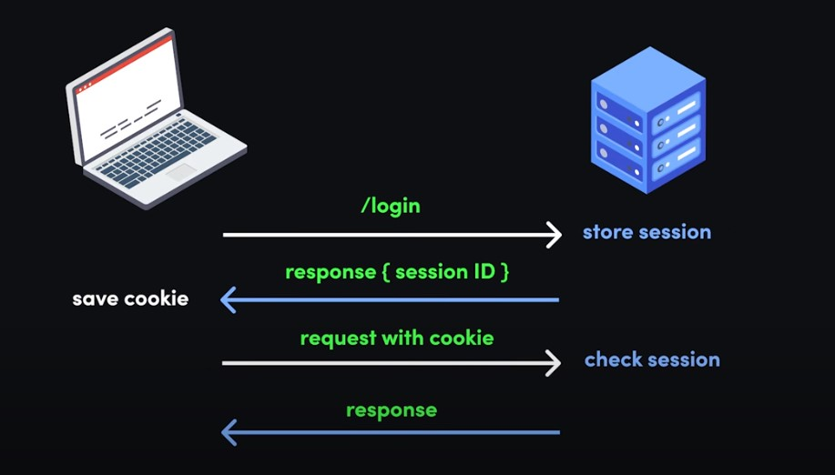

## cookie-based Authentication
(cookie-based server-side sessions)當你登入時,服務器會返回一組cookie,這組cookie是用於證明用户身份,每個後續請求將包括cookie，從而允許用戶訪問允許的路由，服務和資源。。但cookie-based Authentication具有以下缺點。



### CSRF攻击
cookie是由服務器生成并發送給客戶端的,意味如果有人在中間截獲你的cookie就可以冒充你向服務器發請求,有可能會引發安全問題。這種***攻击者盗用了你的身份，以你的名义发送请求***的攻擊行為我們稱之為Cross-site-request forgery(CSRF)。從服务器来看你與攻擊者都是同一人,攻擊者可以輕易地用你的名义发送邮件、发消息等。但在今天各種框架與瀏覽器的約束下,受CSRF攻擊的機險非常低。

###  增加服務器的存儲壓力
服務器需要存儲對應的Session ID,以比對用戶傳過來的cookie是否正確。增加服務器的存儲壓力。


## Token-based Authentication
JSON Web令牌以緊湊的形式由三部分組成，這些部分由點（`.`）分隔，分別是：

- header
- payload
- signature

因此，JWT通常如下所示。

```
xxxxx.yyyyy.zzzzz
```

### Header
header*通常*由兩部分組成:令牌的類型和所使用的簽名算法，例如HMAC SHA256或RSA。然後，此JSON被**Base64Url**編碼以形成JWT的第一部分。

### payload
payload包含聲明。聲明通常是有關實體（通常是用戶）和其他數據的聲明。然後對payload進行**Base64Url**編碼，以形成JSON Web令牌的第二部分。

### signature
簽名用於驗證消息在此過程中沒有更改，並且對於使用私鑰進行簽名的令牌，它還可以驗證JWT的發送者是它所說的真實身份。